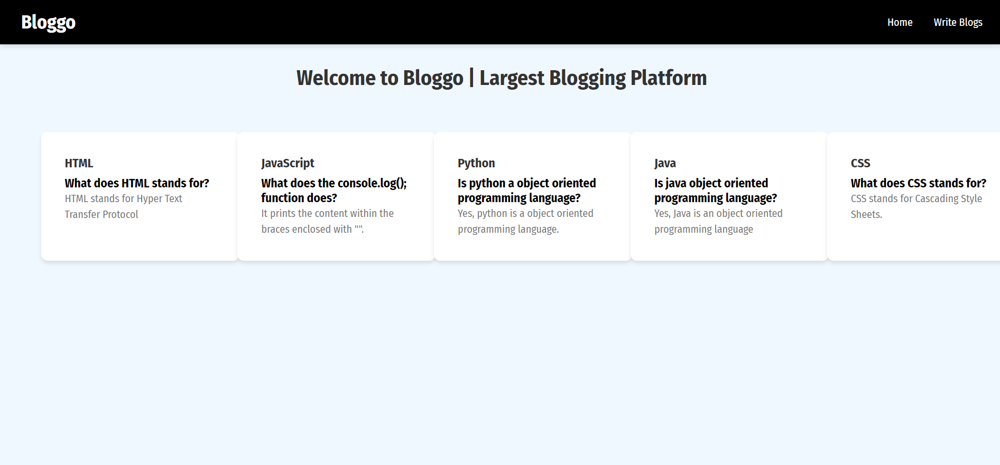

# Online Blogging Platform



## Overview

This is an online blogging platform that allows users to perform CRUD (Create, Read, Update, Delete) operations on blog posts. The platform features a robust user interface for writing, editing, viewing, and deleting posts.

## Features

- **Create**: Users can write and publish new blog posts.
- **Read**: Users can view published posts.
- **Update**: Users can edit their own blog posts.
- **Delete**: Users can delete their blog posts.
- **User Authentication**: Secure login and signup functionality.

## Tech Stack

- **Backend**: Node.js, Express.js
- **Database**: MongoDB
- **Frontend**: [Specify frontend technology if applicable]
- **Environment**: [Specify any specific environment or configuration if applicable]

## Installation

1. **Clone the repository**

   ```bash
   git clone https://github.com/adityadhiman-in/bloggo_mern_stack.git
   ```

2. **Navigate to the project directory**

   ```bash
   cd your-repository
   ```

3. **Install dependencies**

   ```bash
   npm install
   ```

4. **Set up environment variables**

   Create a `.env` file in the root directory and add the following environment variables:

   ```env
   PORT=3000
   MONGO_URI=your_mongodb_connection_string
   ```

5. **Start the application**

   ```bash
   npm start
   ```

   The server will run on `http://localhost:3000`.

## Usage

1. **Access the application**: Open your browser and go to `http://localhost:3000`.

2. **Endpoints**:
   - `POST /posts` - Create a new blog post
   - `GET /posts` - Retrieve all blog posts
   - `GET /posts/:id` - Retrieve a single blog post by ID
   - `PUT /posts/:id` - Update a blog post by ID
   - `DELETE /posts/:id` - Delete a blog post by ID

## Middleware and Configuration

- **CORS**: Enabled for `http://localhost:3000` and `http://localhost:5173`.
- **Body Parsing**: JSON and URL-encoded data are supported.

## Contributing

Feel free to fork the repository and submit pull requests. If you find any issues or have suggestions for improvements, please open an issue on GitHub.

## License

This project is licensed under the MIT License - see the [LICENSE](LICENSE) file for details.

## Contact

Feel free to reach out if you have any questions or suggestions!

- [Website](https://adityadhiman.in)
- [GitHub](https://github.com/adityadhiman-in)
- [LinkedIn](https://www.linkedin.com/in/adityadhiman-in)

Made with ❤️ by [Aditya Dhiman](https://adityadhiman.in)
